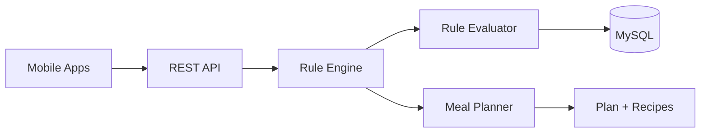
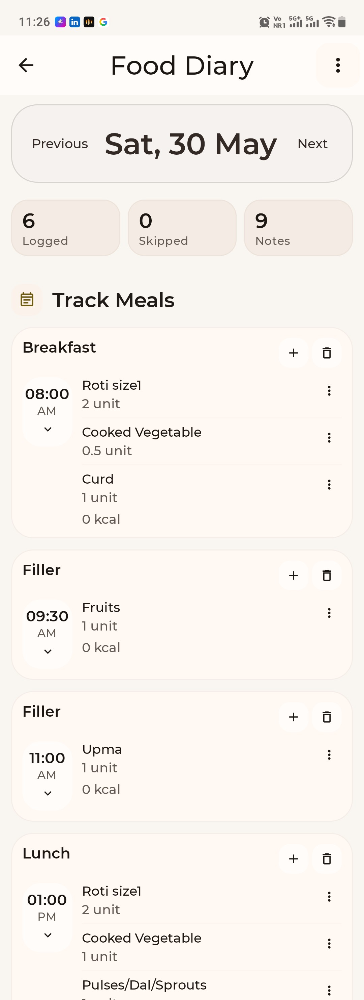
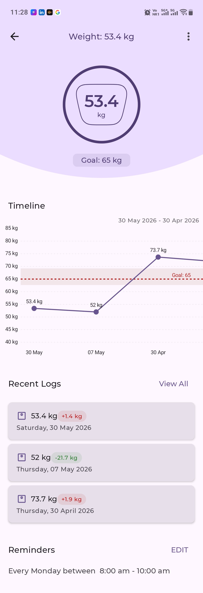
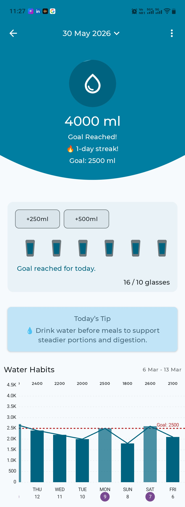
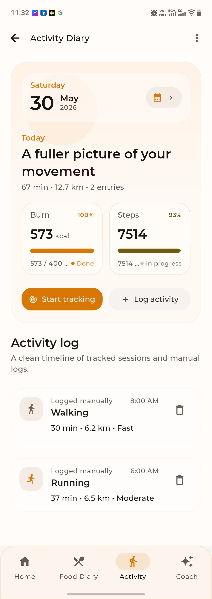

# Hi, I'm Vishwambhar Patil

**Senior Software Engineer** · Backend automation · Production mobile · Full-stack platforms

I build systems that replace manual operations with reliable software — from rule-driven diet engines and call-scheduling automation to Play Store / App Store nutrition apps and large-scale campaign platforms.

**1,000+ diet plans/month** · **64,000+ voter records** · **Play Store & App Store** · **~10 years** in production software

---

## About Me

- **~10 years** shipping software in health, nutrition, and operations-heavy domains
- **Backend focus:** Java, Spring Boot, REST APIs, JPA, MySQL — workflow automation, scheduling, and rule-based engines
- **Mobile leadership:** Led Android & iOS development for a production nutrition platform (Google Play & Apple App Store)
- **Full-stack:** Next.js, TypeScript, Supabase/PostgreSQL for data-heavy, multi-role web products

**Currently exploring:** microservices patterns, Docker, CI/CD, and cloud-native backend architecture.

**Ask me about:** Spring Boot system design, REST APIs, task/call automation, diet rule engines, mobile architecture (Kotlin Compose / Swift), or scaling ops tooling.

---

## Featured Projects

### Diet Engine Automation Platform

Rule-driven engine that generates personalized meal plans from preferences, health conditions, carb cycling, substitutions, and customer history — one of the highest-impact systems from a decade in nutrition tech.

| | |
| --- | --- |
| **Impact** | **1,000+** plans/month · prep time **5–10 min → ~1 min** · eliminated most manual drafting |
| **Stack** | Java · Spring Boot · MySQL · rule-engine architecture · REST APIs |
| **Highlights** | Rule evaluation · meal substitution · nutritional calculations · dynamic replanning |
| **Case study** | [docs/diet-engine-case-study.md](docs/diet-engine-case-study.md) *(private production codebase)* |

---

### Voter Campaign Management Platform

Large-scale election campaign platform: **64,000+ voter records**, multi-role access (admin, candidate, volunteer), surveys, analytics, WhatsApp campaigns, and a custom strategy engine for influence, conversion, and mobilization scoring.

| | |
| --- | --- |
| **Impact** | Mobile-first volunteer workflows and data-driven campaign recommendations |
| **Stack** | Next.js · React · TypeScript · Supabase · PostgreSQL · Tailwind · Vercel |
| **Highlights** | Strategy engine · geospatial analytics · RBAC · bulk messaging |
| **Repo** | [voter-strategy](https://github.com/vishuavi777-eng/voter-strategy) |
| **Demo** | [Candidate walkthrough](https://youtu.be/5HRaQ7l-Yu0) · [Volunteer walkthrough](https://youtu.be/OfFBrQsmdgo) |

  
  

  

---

### Task & Call Management Automation

Spring Boot system that automates daily work allocation for customer service teams — scheduling weight-check, birthday, motivation, feedback, pre/post-diet, and follow-up calls with fair distribution and reassignment when staff are absent.

| | |
| --- | --- |
| **Impact** | Reduced manual assignment effort and improved workload balance across teams |
| **Stack** | Java · Spring Boot · Spring Data JPA · MySQL · REST |
| **Highlights** | Auto-scheduling · availability-based assignment · completion tracking · centralized visibility |
| **Repo** | [springboot-task-scheduling-system](https://github.com/vishuavi777-eng/springboot-task-scheduling-system) |

---

### Milk Diary — Tracker & Billing

JavaFX desktop app for small dairy outlets: daily milk collection, member management, rate plans, monthly billing, savings, PDF reports, and backup/restore — built for real field use, not a toy CRUD demo.

| | |
| --- | --- |
| **Impact** | End-to-end billing and reporting for milk vendors and suppliers |
| **Stack** | Java 23 · JavaFX · Hibernate · SQLite · Flyway · Gradle |
| **Highlights** | Fat/SNF pricing · Marathi UI · PDF bills · local-first SQLite |
| **Repo** | [MilkDiary](https://github.com/vishuavi777-eng/MilkDiary) |

  
  

---

### Nourish Genie — Mobile Platform

Production nutrition & health coaching app on **Google Play** and the **Apple App Store**. Led Android & iOS development; currently rebuilding the Android app with **Kotlin and Jetpack Compose**.

| | |
| --- | --- |
| **Role** | Lead mobile developer — Android & iOS, team leadership, stakeholder collaboration |
| **Production stack** | Java · Android SDK · Swift · UIKit · REST · Firebase |
| **Compose rebuild** | Kotlin · Jetpack Compose · MVVM · Retrofit · Coroutines |
| **Tracking modules** | Food diary · weight · water · activity · medicine |

  
  
  
  

---

## Tech Stack

---

## GitHub Activity

---

  <b>Open to Senior Backend / Full-stack roles</b> — Java, Spring Boot, workflow automation, and product-focused engineering teams. 
  <i>Also happy to collaborate on scalable platform and mobile-adjacent product work.</i>

