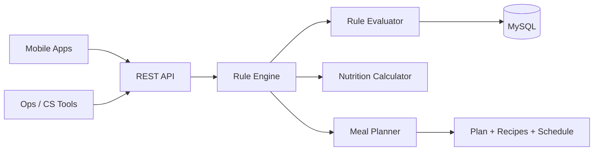

# Diet Engine Automation Platform — Case Study

> Production system built for a nutrition company. Source code is private; this document summarizes architecture and business impact for portfolio purposes.

## Problem

Dieticians and operations teams spent **5–10 minutes** manually drafting a customized meal plan for every customer — preferences, restrictions, health conditions, carb cycling, and program rules all handled by hand.

## Solution

A **rule-driven diet generation engine** on Java and Spring Boot that evaluates customer profiles against a configurable rule set and produces complete meal plans programmatically.

## Business Impact

| Metric | Before | After |
|--------|--------|-------|
| Plan prep time | 5–10 min | ~1 min |
| Monthly volume | Manual cap | **1,000+** personalized plans |
| Manual drafting | Primary workflow | Largely eliminated |

## Core Capabilities

- Personalized meal plan generation from customer profile and history
- Food preference and restriction matching
- Carb cycling and dynamic meal substitution
- Nutritional calculations and plan optimization
- Recipe and meal instruction generation
- REST APIs for mobile app and ops tooling integration

## Architecture Overview

## Engineering Highlights

- Layered Spring Boot architecture with clear service boundaries
- Complex rule evaluation pipeline with preference matching and substitution logic
- Dynamic replanning based on customer history and program phase
- Designed for high-volume monthly generation in a production nutrition business

## Stack

Java · Spring Boot · MySQL · REST APIs · Rule-engine architecture
